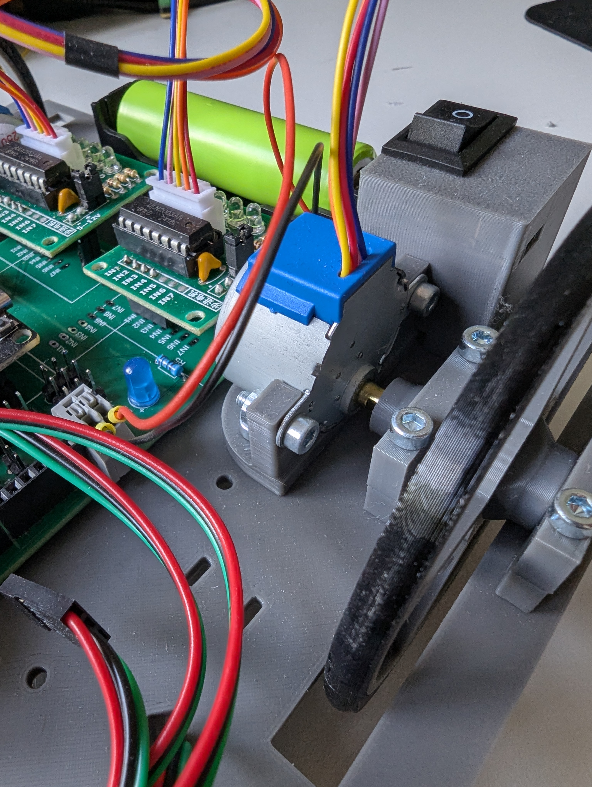
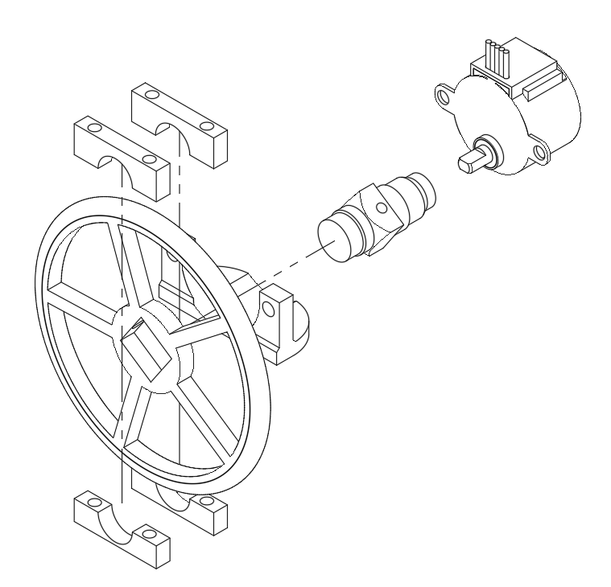
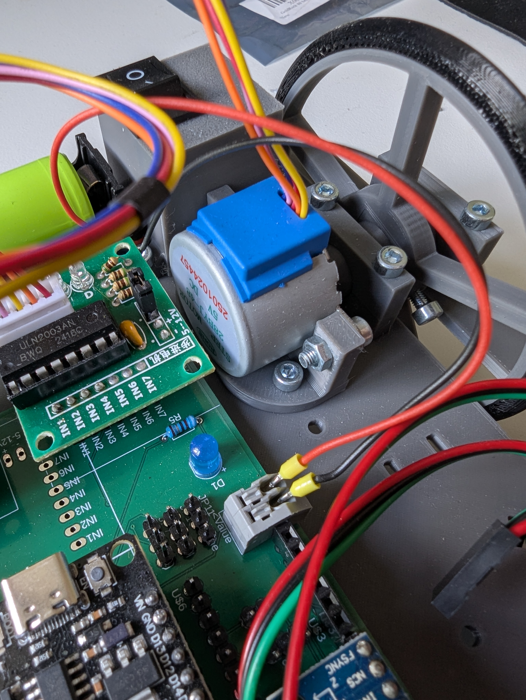
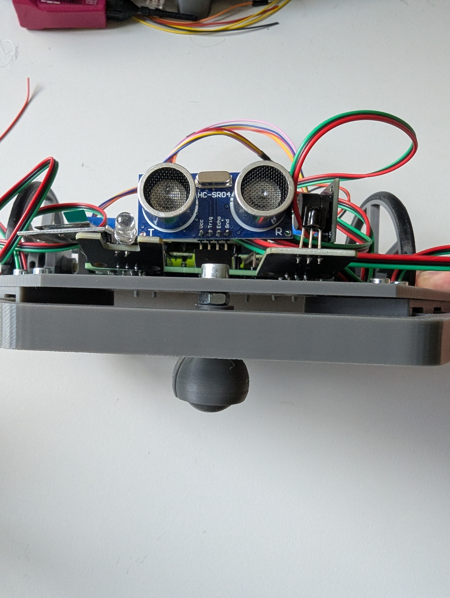
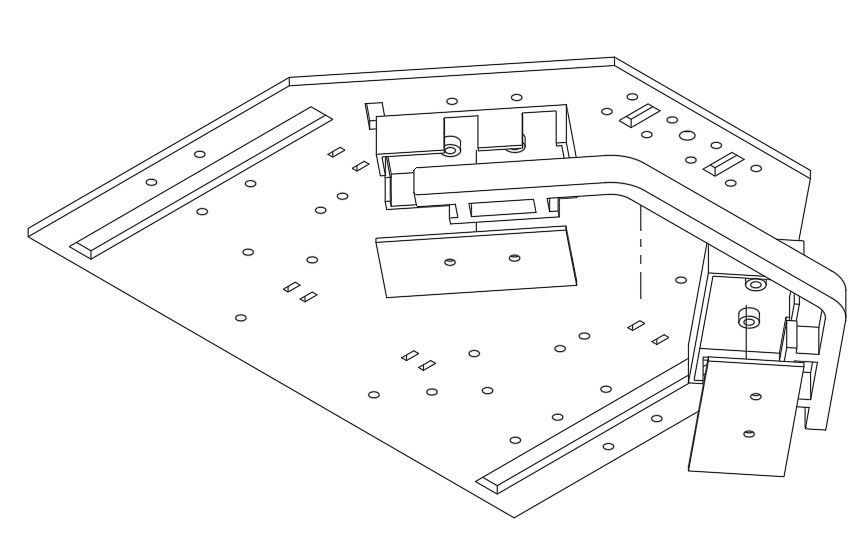
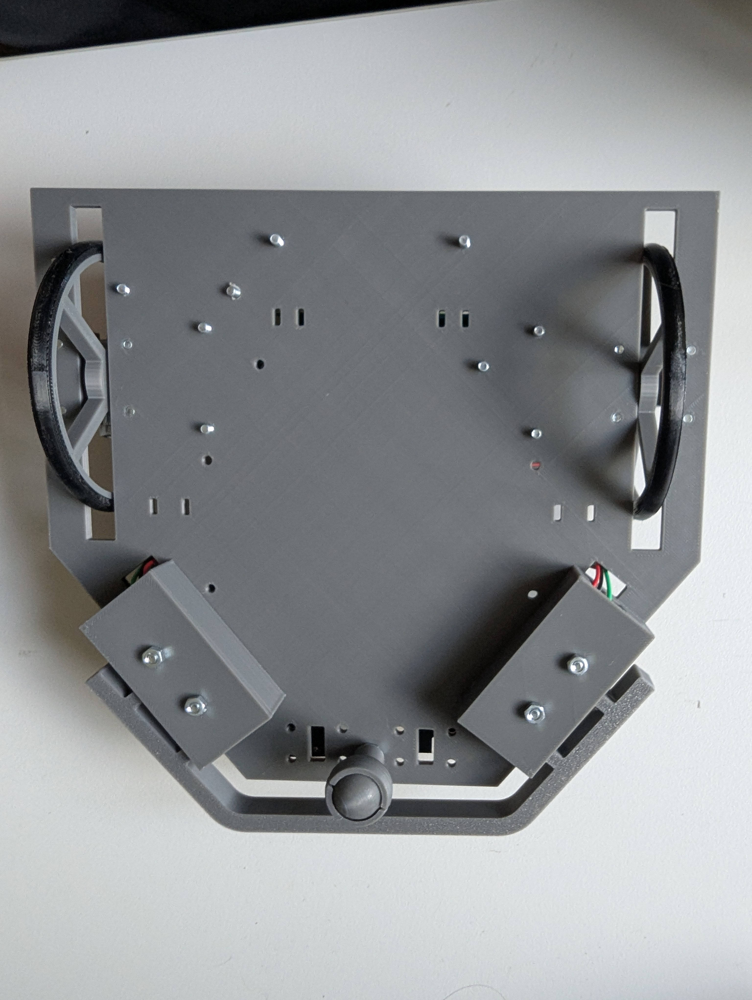
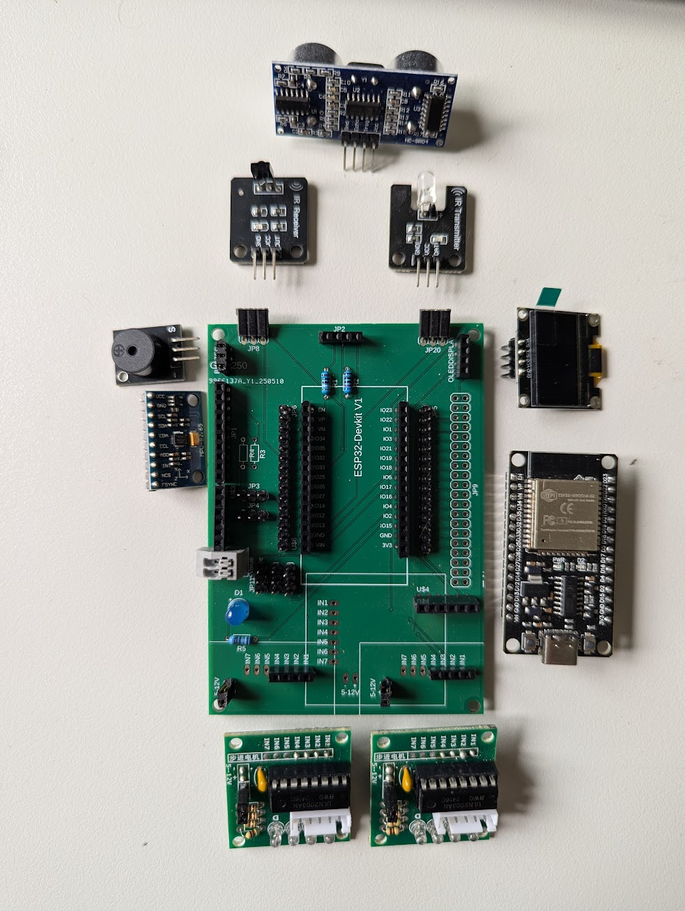
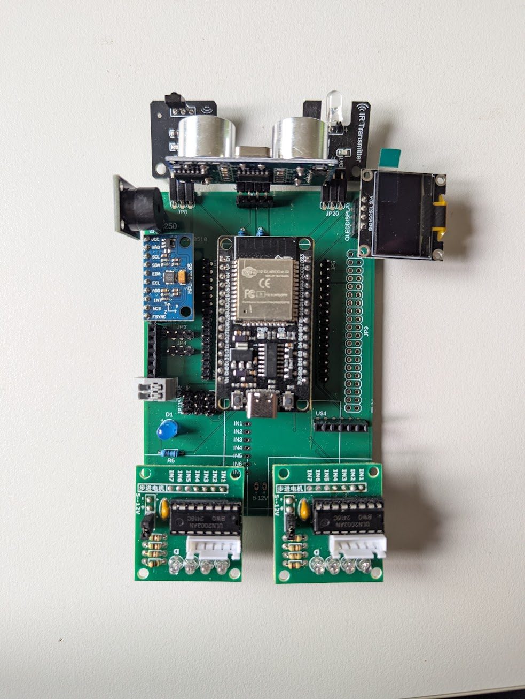
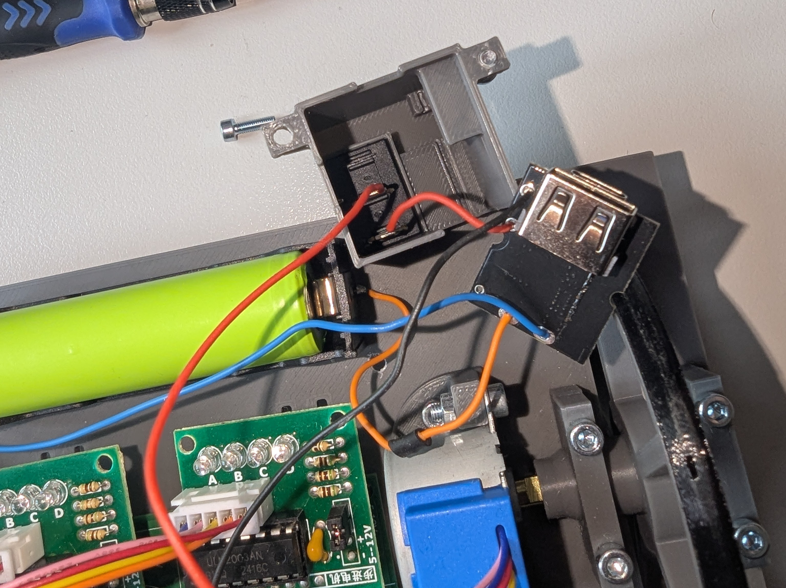
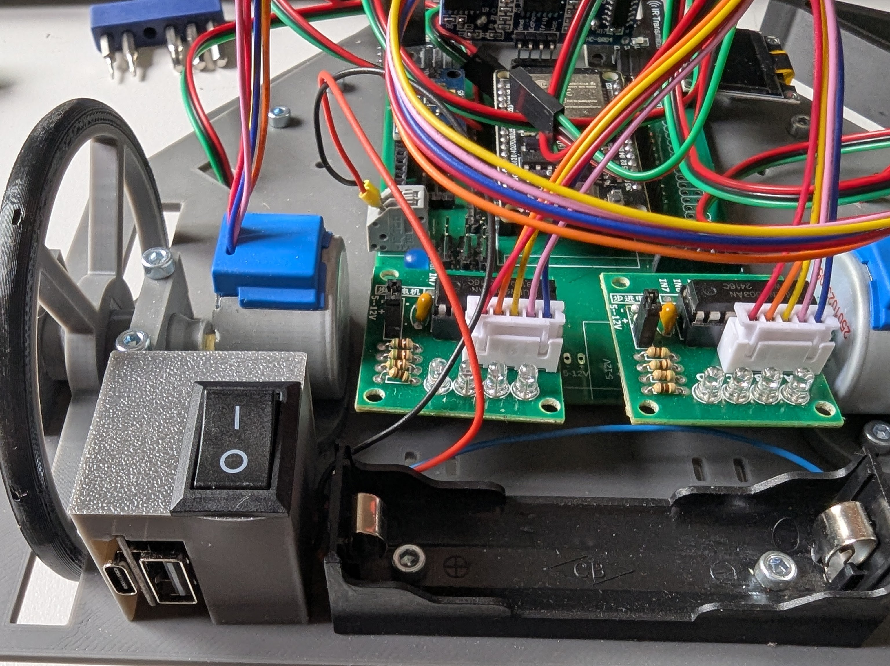

# 🛠️ Bauanleitung  
---
Nachdem alle Teile beschafft wurden, kann der Zusammenbau beginnen.  
Bitte stellen Sie sicher, dass Sie folgende Teile haben:  

### 🔩 Mechanische Befestigung  
- **12×** M3×20 Schrauben  
- **14×** M3×10 Schrauben  
- **8×** M3 Muttern  
- **1×** M4×10 Schraube und Mutter  

### 🖨️ 3D-gedruckte Teile  
- **1×** [Hauptplatte](./STL_Dateien/Hauptplatte.stl)  
- **4×** [Lagerung Oben](./STL_Dateien/Lagerung_Oben.stl)  
- **4×** [Lagerung Unten](./STL_Dateien/Lagerung_Unten.stl)  
- **2×** [Welle](./STL_Dateien/Welle%20v9.stl)  
- **2×** [Motor Clip](./STL_Dateien/Motor_Clip%20v4.stl)  
- **1×** [Lademodul + Schalter Gehäuse](./STL_Dateien/Lademodul+Schalter%20gehäuse%20v5.stl)  
- **1×** [Murmel](./STL_Dateien/Murmel.stl)  
- **1×** [Murmelhalter](./STL_Dateien/Murmelhalter.stl)  
- **2×** [Reifen](./STL_Dateien/Reifen.stl)  
- **2×** [Rad](./STL_Dateien/Rad.stl)  
- **2×** [Bumper Deckel](./STL_Dateien/Bumper_deckel.stl)  
- **1×** [Bumper Gehäuse Links](./STL_Dateien/Bumper_Körper_Links.stl)  
- **1×** [Bumper Gehäuse Rechts](./STL_Dateien/Bumper_Körper_Rechts.stl)  
- **1×** [Bumper](./STL_Dateien/Bumper.stl)  

### 🔌 Elektronik & Steuerung  
- **1× Platine** (eigene Entwicklung, siehe [`hardware/`](./hardware))  
- **1× ESP32** (DevKit-Modul)  
- **2× ATtiny 212** (zur Motoransteuerung)  
- **1× Akkuhalterung für 18650-Zelle**  
- **1× 18650 Li-Ion Akku**  
- **1× Lademodul**  
- **1× Kippschalter**  

### ⚙️ Antrieb  
- **2× 28BYJ-48 Schrittmotoren** mit **ULN2003-Treiberplatinen**  

### 🎛️ Sensoren & Aktoren  
- **1× GY-9250 (IMU)**  
- **1× HC-SR04 (Ultraschallsensor)**  
- **1× APDS-9960 (Farb- und Gestensensor)**  
- **2× Mikroschalter** (Bumper)  
- **1× IR-Sende-/Empfangsmodul**  
- **1× OLED Display (128×64 Pixel, I²C)**  
- **1× Piezo-Buzzer**  

---

### 🔧 Schritt 1 – Antrieb  

Zuerst werden die **Antriebe** montiert und auf der Hauptplatte befestigt.  
Am einfachsten ist es, die **Motor-Clips** zuerst anzuschrauben und danach den kompletten Aufbau auf einmal in Position zu bringen und festzuschrauben.  
Dabei darauf achten, dass das **breitere Lagerteil („Lager Oben“) oben** ist.  

➡️ Die Räder können bei Bedarf zusätzlich mit Schrauben an den Achsen fixiert werden.  

  
  &nbsp;
  
  &nbsp;
  

---

### ⚙️ Schritt 2 – Kugelhalter (Murmel)  

Als Nächstes wird vorne der **Murmelhalter** mit der Kugel (Murmel) montiert.  
Dazu zunächst eine **M4-Schraube mit Mutter** am Hauptkörper befestigen.  
Anschließend den Murmelhalter auf die Schraube aufschrauben.  

➡️ Jetzt sollte der Roboter bereits eigenständig stehen können.  

---

### 🛡️ Schritt 3 – Bumper  

Nun werden die **Taster** in die Bumper-Gehäuse eingesetzt und mit **4× M3×20 Schrauben und Muttern** am Hauptkörper befestigt.  
Die Bumper werden links und rechts montiert (von vorne betrachtet).  

  
  &nbsp;
  

---

### 🖥️ Schritt 4 – Platine  

Als Nächstes wird die **Platine bestückt** und anschließend auf der Hauptplatte montiert.  
Befestigen Sie die Platine mit **M4×10-Schrauben** auf der Hauptplatte.  

Danach können die **Motorstecker** in die jeweiligen **Treiberplatinen** eingesteckt werden.  

  
  &nbsp;
  

---

### 🔋 Schritt 5 – Akku und Laderegler  

Nehmen Sie den **Akkuhalter** und löten Sie Kabel an die **+**- und **–**-Kontakte.  
Verbinden Sie diese mit den entsprechenden **+**- und **–**-Kontakten am **Lademodul**.  
Achten Sie unbedingt darauf, die für den Akku vorgesehenen Kontakte zu verwenden.  

Anschließend den **+ Kontakt** für den **5V-Ausgang** an den **Schalter** löten.  
Dann Schalter und Lademodul in das vorgesehene Gehäuse einsetzen.  

Zum Abschluss den **GND-Kontakt** des Lademoduls sowie die **5V-Leitung nach dem Schalter** an die vorgesehenen Kontakte der **Platine** anlöten.  
Danach den **Batteriehalter** und das **Lademodul-Gehäuse** mit der Hauptplatte verschrauben.  

  
  &nbsp;
  

